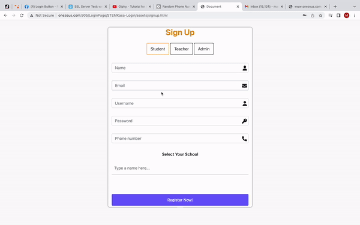
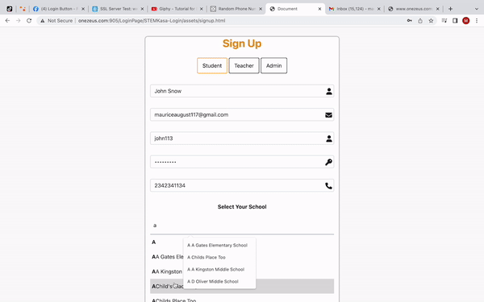
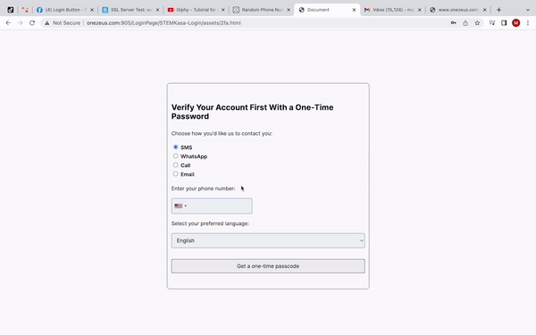

# Small Business Login Page 

A multi-page app written during my first full stack internship that allows users to login to a STEM learning platform. 

## Demo

## Tech Stack

**Client:** React, CSS, Twilio

**Server:** Node, Express

## Features

- 2fa toggle in second verification page
- Form validation
- Fetches U.S. school information
- Email confirmation when login is sucessful
- Password reset with verification
